# DellCommandUpdate_MCC
An unofficial method to integrate Dell Command Update with Microsoft Connected Cache
## Getting Started

This guide will detail how to set up this particular integration between Dell Command Update and a Microsoft Connected Cache

### Prerequisites

1) Microsoft Connected Cache

An SCCM environment that supports Microsoft Connected Cache and has at least one Distribution point configured as a MCC.
Please refer to the official Microsoft documentation on how to do this.

https://docs.microsoft.com/en-us/mem/configmgr/core/plan-design/hierarchy/microsoft-connected-cache

Windows should be made aware of this MCC either through direct GPO configuration or by configuring the SCCM client to configure Delivery Optimization settings.

2) Dell Command Update

A Dell Command Update installation. 3.1 or higher required.
Please refer to the official Dell documentation on how to do this.

https://www.dell.com/support/article/en-us/sln311129/dell-command-update?lang=en

### Overview

Dell Command Update (DCU) is Dell's tooling for deploying driver and firmware updates to clients.

In its default configuration it will scan for applicable updates versus a catalog file hosted on Dell's CDN and also download the sources for any updates from that same CDN.

The problem with this is that such a setup is problematic for environments with remote sites behind a WAN link, as total download size can easily surpass 1GB per client when running a full update on a freshly imaged machine.

Dell's own solution for this is to use Dell Repository Manager (DRM) to create an onprem repository of sources and then use a custom Catalog.xml file for DCU to point DCU towards the DRM repository. While this technically works, creating and maintaining the onprem repository is quite labour intensive, and the total size of the repository can easily reach 100 GB, of which maybe half is actually needed.

On top of this, there is the issue with pointing clients towards the repository in a dynamic way, since you would be hosting a copy of this repository in each site behind a WAN link.

My solution for this was to piggyback on a solution Microsoft had already provided for this exact problem, but aimed at Microsoft's own CDN downloads: Delivery Optimization In-Network Cache (DOINC), now rebranded as Microsoft Connected Cache (MCC).

An added benefit of this solution is that it has change management and piloting capabilities built-in, which is also something DCU is lacking out of the box.

The end result is that I don't have to do active repository management, don't waste space and bandwidth by distributing content to sites that don't need it, but still get the benefits of local caching and throttled downloads.

#### Background : Microsoft Connected Cache internals

To summarize briefly, the SCCM version of MCC uses IIS Application Request Routing to become a HTTP caching proxy for Microsoft's CDNs.

It works by defining the CDNs as Server Farms in IIS on the DP, with associated cache, and then using specific ARR rules to allow clients to connect to the DP and download the content from the CDN through the DP.

Since there is nothing proprietary about this, it is just using existing IIS functionality in a clever way, it is fairly trivial to extend upon.

## Setup

### 1) Microsoft Connected Cache configuration extension
This section describes how to manually configure IIS and LEDBAT for this extension. All of this should be scriptable, but I have chosen here to walk through the manual steps.

To start, log into the MCC enabled distribution point with an account that has Administrator privileges on said server.

#### 1.1) IIS configuration

Open the IIS console and navigate to "Server Farms"

Click "Create Server farm"

Call it "Farm_downloads.dell.com" and add "downloads.dell.com" as server address.

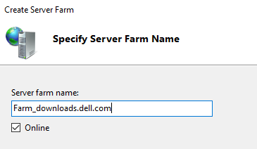

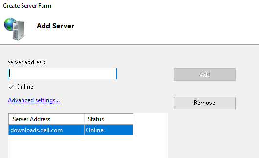

Click "NO" when asked to automatially create URL rewrite rules.

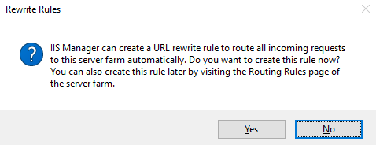

Select the newly created server farm and edit settings

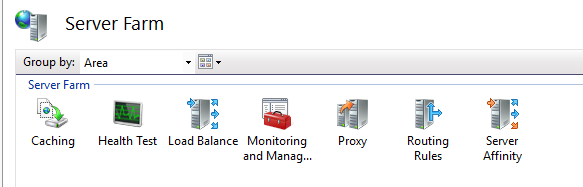

-Under "Caching", change duration to 600 seconds

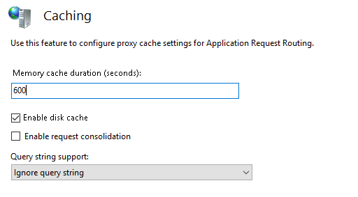

-Under "Proxy", change timeout to 300 seconds and response buffer treshold to 1024kb

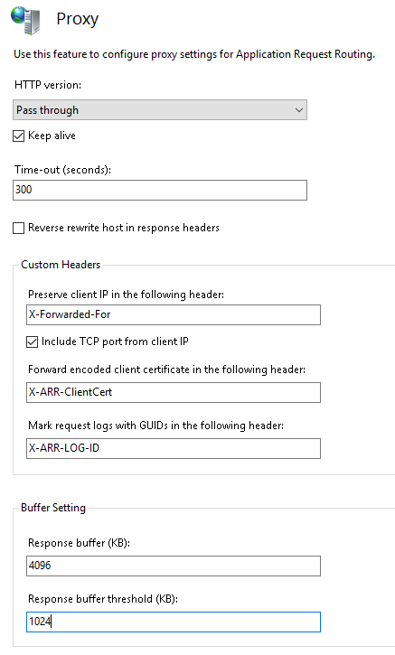

Note: these are the same settings Microsoft configures on their own CDN server farms when setting up MCC

Navigate to "Sites" and select "Default" website

Open "URL Rewrite"

Click "Add Rule", and select "Blank Rule"

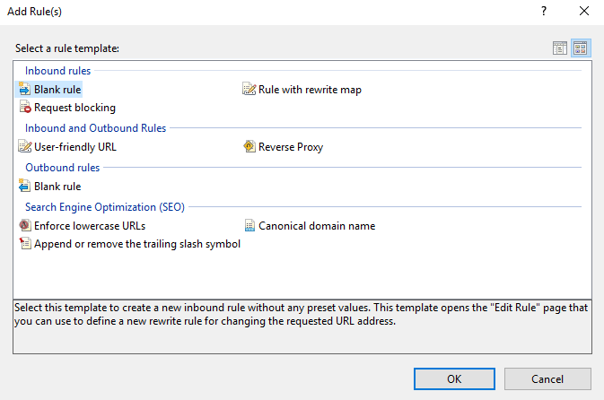

Configure the following:

-Name : ARR_downloads.dell.com

-Match URL : .*

-Conditions : {URL} matches pattern /DellDownloads/(.*)

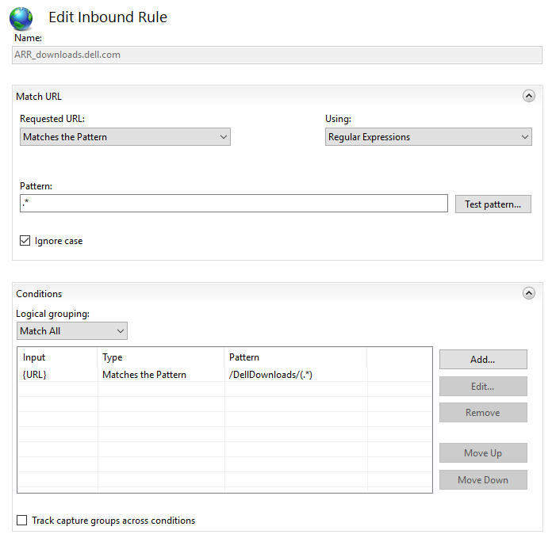

-Server Variables : HTTP_HOST downloads.dell.com, replace existing value

-Action : Rewrite, http://Farm_downloads.dell.com/{C:1} , Stop processing subsequent rules

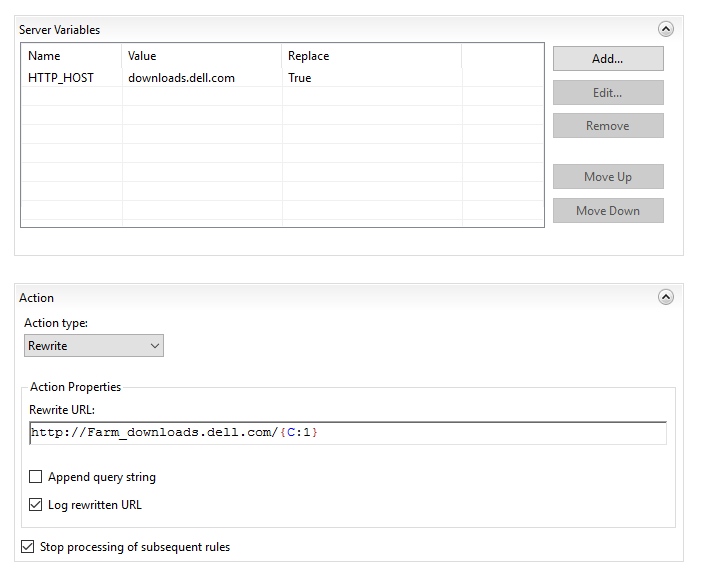

This concludes the IIS part of the configuration.

The net result is now that the URL

"http://yoursccmdp.fqdn/DellDownloads" is a caching proxy for "http://downloads.dell.com".

#### 1.2) LEDBAT configuration
LEDBAT is a throttling technology available from Windows Server 2016 and up. It can be configured by checking a checkbox in the properties of the SCCM distribution point in the SCCM console.

The rules SCCM configures are aimed at connections coming in on port 80 and 443, which are the ports the DP will serve content on. This is good as it will be re-used in this configuration here, since we will be using port 80.

However this only covers the connection between the DP and the client, there is still the issue that the DP will download the content from the CDN and thus might still saturate the WAN link itself. Therefore we also want to configure LEDBAT between the server and the CDN.

First, verify that LEDBAT is configured on the DP. In a Powershell admin prompt type

```
Get-NetTransportFilter
```

And verify you see the rules for port 80 and 443

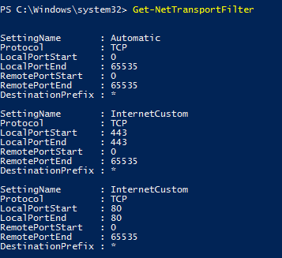

Next, we will add a LEDBAT rule for connection to the CDN. However, which rule we need to add depends on the environment

-If you are using a corporate proxy and have configured MCC to use it, you need to use the IP of the proxy since network-wise the TCP connection will be between the server and the proxy

-If you are not using a proxy, you need to use the IP of the CDN. This IP can be retreived by doing a DNS lookup for "downloads.dell.com". In this example I will be using 152.199.20.130

Add the LEDBAT rule by entering the following on the Powershell prompt

```
New-NetTransportFilter -SettingName InternetCustom -Protocol TCP -DestinationPrefix "152.199.20.130/32"
```

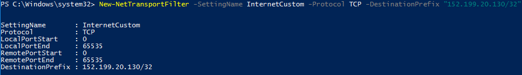

Verify again that the rule is added

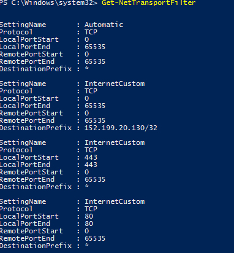

This concludes the LEDBAT part of the configuration

### 2) Dell Command Update configuration script

This section uses the [ConfigureDCUcatalog.ps1](ConfigureDCUcatalog.ps1) script.

The script expects to find in the same folder that it is located a file "CatalogPC.zip" containing a valid "CatalogPC.xml" file for Dell Command Update.

In addition, a secondary "PilotCatalogPC.zip" with similar content can be placed in the same folder in order to allow piloting.

Thirdly, the script supports creating a folder with the model name and putting a CatalogPC.zip and PilotCatalogPC.zip file in it to target a specific catalog to a specific model.

#### 2.1) What the script does

When run on a machine, the script will

-Look for the Dell Command Update CLI

-Unpack the appropriate ZIP file containing the catalog for the machine, taking into account piloting and model specific catalogs

-Check if a MCC server is configured and if so, modify the baseLocation attribute to point it towards the MCC server for downloads

-Write the XML file to the local filesystem

-Call the DCU CLI to configure DCU to use said XML file

#### 2.2) Obtaining CatalogPC.xml

The easiest way is to download the following file

https://downloads.dell.com/Catalog/CatalogPC.cab

And extract it from within this file.

Alternatively, use Dell Repository Manager to create one.

https://www.dell.com/support/driver/en-us/DriversDetails?driverId=KWT9C

#### 2.3) Creating the CatalogPC.zip file

Not difficult, just make a ZIP file with the CatalogPC.xml file in the root.

PilotCatalogPC.zip is the same thing, just a different name.

#### 2.4) Deploying the script

There are many ways you can deploy it, but the easiest is just creating an SCCM package with the script and ZIP files in it, with a program calling the script.

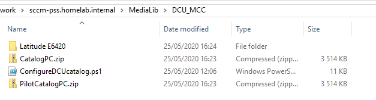

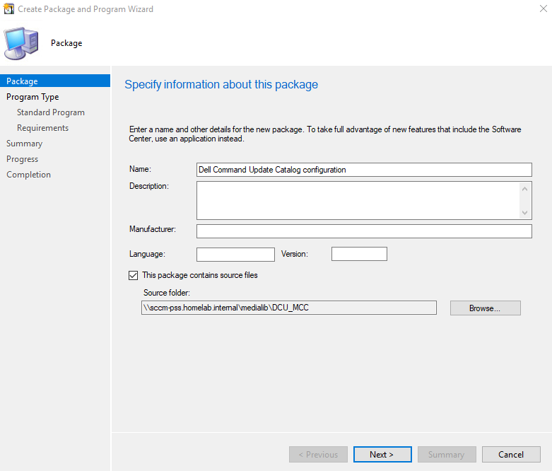


I would advise deploying the script on a repeating schedule, for example daily. This is to cover the scenario where clients roam between boundaries and the MCC server that is appropriate for them changes. In this scenario, the XML file needs to be modified to reflect this, and this is easiest done by just re-running the script.

## Verifying functionality

To verify that the solution is working, you can check the following

### ConfigureDCUcatalog.ps1 log

By default you should be able to find it on the client at

```
%TEMP%\ConfigureDCUcatalog.log
```

You should be able to see that it finds the files and MCC server and uses them to write the file

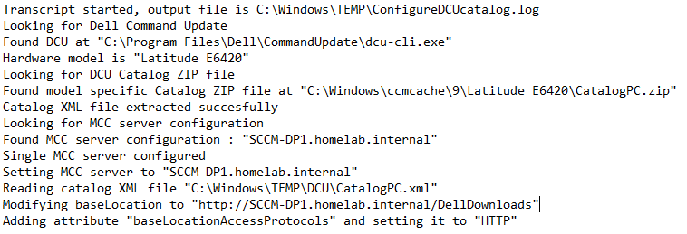

### DCUCatalog.xml file

By default you should be able to find it on the client at

```
%PROGRAMDATA%\Dell\UpdateService\DCUCatalog.xml
```

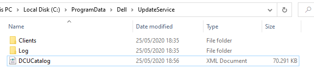

If you open the file you should be able to see that the baseLocation has been modified

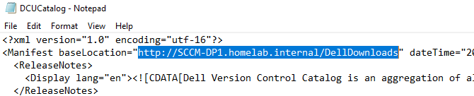

### Dell Command Update Service log

By default you should be able to find it on the client at

```
%PROGRAMDATA%\Dell\UpdateService\Log\Service.log
```

If you open the file you should be able to see that it uses the catalog XML file and knows of the new baseLocation

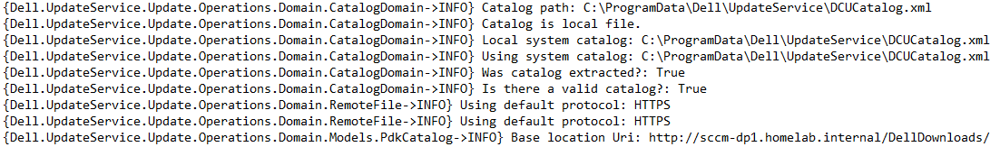

When downloading an update, you should be able to see that it downloads from the MCC server

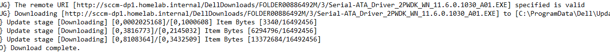

### IIS logs

By default you should be able to find it on the MCC enabled DP at

```
C:\inetpub\logs\LogFiles\W3SVC1
```

If you open the log file you should be able to see downloads under the "DellDownloads" URL

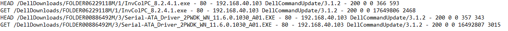

### DOINC cache folder

You will find this where you configured it in your Distribution Point settings. In my example this is the D: drive.

When browsing the folder you should see a "downloads.dell.com" folder

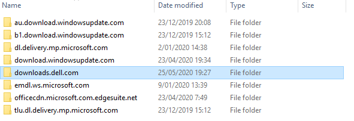

And within that you should find the content you have downloaded

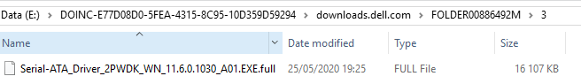

## Q&A

Q : Is this supported by Dell?

A : This exact solution : no, but I am using officially supported functionality of DCU here in redirecting the downloads to a different location, so the end result is "kind of". It will work as long as DCU supports downloads from HTTP.


Q : Is this supported by Microsoft?

A : No. I'm fairly sure that the adding of the custom rules to MCC that I do here is not supported by Microsoft.


Q : The configuration bit for the DP is extensive, can you automate it?

A : That's up next for me. Configuring LEDBAT is easy, but for the IIS stuff I'll have to dig into Microsoft's DOINC setup scripts, and *technically* you're not supposed to do that if you read the readme file in the DOINC setup folder.

Q: What's that 64bit detection stuff at the top of your script?

A: Command line execution when deploying from an SCCM package is sadly still run in 32bit mode. This can cause all kinds of problems due tot WOW64 abstraction. That bit of code detects that the script is running as a 32bit process on a 64bit system, and restarts itself by calling a 64bit Powershell with itself and any appropriate command line parameters. At the end it captures the exit code of the 64bit Powershell and passes it immediately as the exit code of the 32bit Powershell that SCCM started.

The end result is that the script always runs in 64bit Powershell, and SCCM is none the wiser.

Q : Why are you using HTTP? For that matter, why is MCC seemingly using HTTP?

A : Because encryption is not needed and would cause issues. The function of encryption is to provide data confidentiality and data integrity.

Data confidentiality is not an issue here, we're dealing with public data.

Data integrity is assured in a different way. In the case of DCU it's the hash of the file that is checked versus the hash in the catalog XML file, and you yourself provide said catalog XML file, thus ensuring integrity. In the case of MCC it's handled by the digital signature of the files you download.

Lastly, if we would have to use HTTPS we would run into the well known SSL interception issues, including providing trusted certificates.

## License

This project is licensed under the MIT License - see the [LICENSE.md](LICENSE.md) file for details
